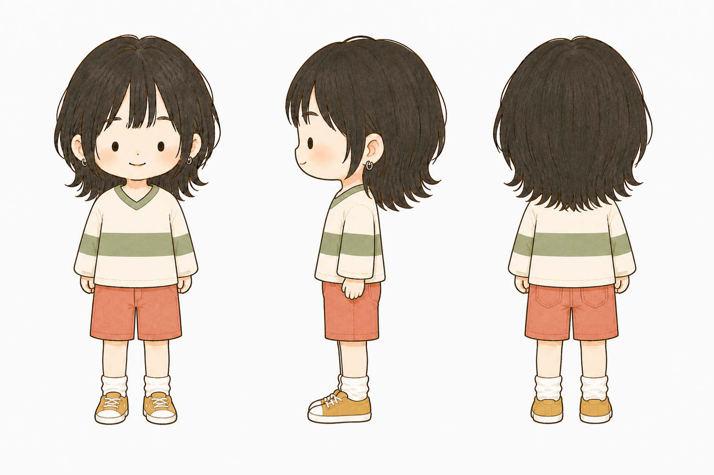
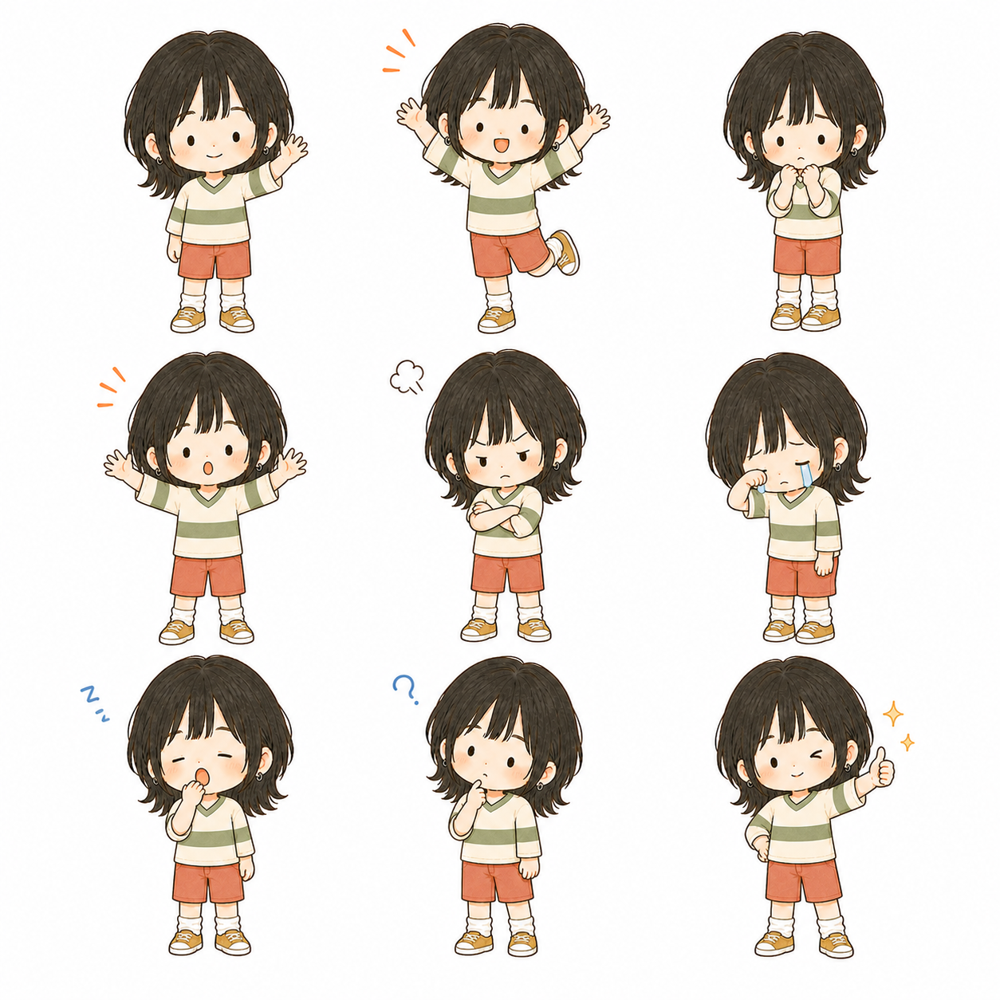
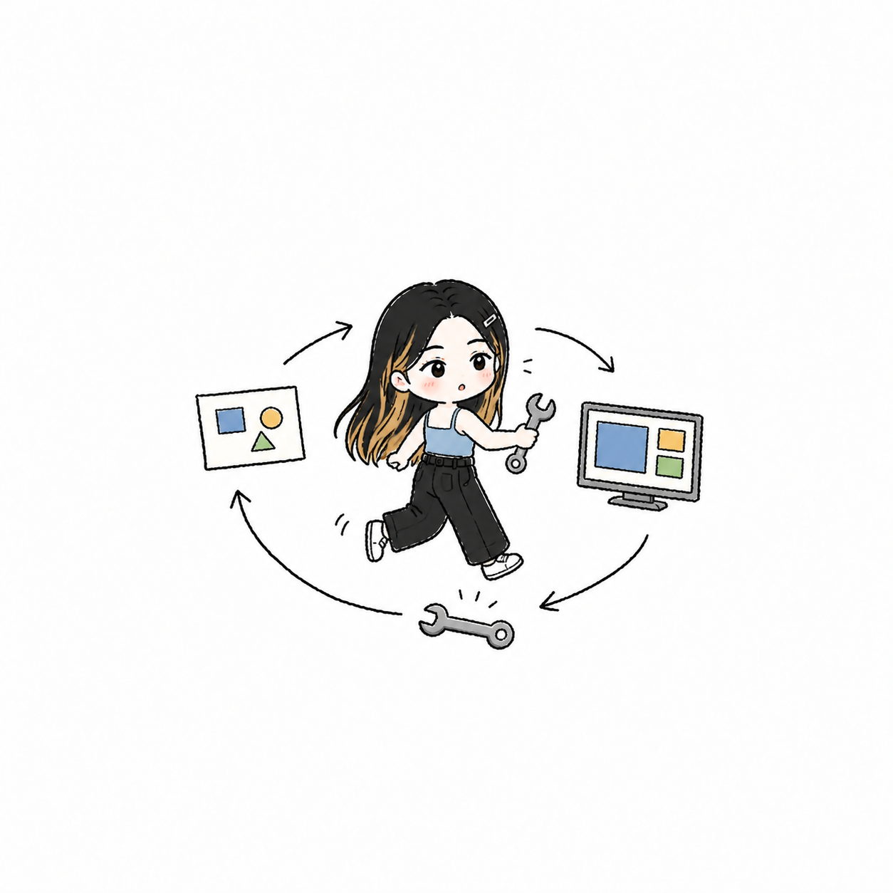

# Build Personal IP

Turn a real-person photo or existing mascot into a reusable personal IP, then apply it consistently to character assets, WeChat illustrations, social visuals, knowledge cards, and infographics.

把真人照片或已有角色转化为可复用的个人 IP，并持续用于角色设定、公众号配图、社交媒体视觉、知识卡片和信息图。

## Examples / 效果示例

### Personal IP system / 个人 IP 角色系统

The same accepted character can be extended into a consistent turnaround and expression library.

确认角色后，可以继续生成统一的三视图和表情资产，供后续内容反复使用。

<table>
  <tr>
    <td width="58%"></td>
    <td width="42%"></td>
  </tr>
</table>

### Content applications / 内容应用

The accepted IP can also appear in article illustrations and knowledge infographics instead of stopping at a character sheet.

角色确认后，可以直接用于公众号正文配图、知识卡片和信息图，而不只是停留在角色设定阶段。

<table>
  <tr>
    <td width="50%"></td>
    <td width="50%"></td>
  </tr>
</table>

These examples contain only finished illustrations. Source identity photos and intermediate test images are not included in the repository.

示例仅展示最终插画，不包含真人原图或中间测试素材。

## What it does / 能做什么

- Uses a built-in cute chibi style when only identity photos are supplied.
- Extracts a custom illustration style when the user provides style references.
- Finalizes identity, hairstyle, outfit, shoes, accessories, and palette together.
- Creates a consistent front/side/back turnaround and 3×3 expression sheet.
- Reuses the accepted character in article illustrations and infographics.
- Keeps pet or companion IP creation optional and disabled by default.

## Workflow / 使用流程

```text
Upload identity photo(s)
        ↓
Default cute style or custom style references
        ↓
Finalize character and styling together
        ↓
Select or accept one design
        ↓
Generate turnaround + expression sheet as one core asset stage
        ↓
Apply the IP to content visuals
```

For content-only requests, the Skill can proceed after the character design is accepted without forcing a full turnaround or expression pack.

如果用户只需要一张文章配图或信息图，确认基础角色后即可直接制作内容，不强制先生成完整三视图和表情包。

## Install / 安装

Clone this repository into your local Codex skills directory. A common local path is `~/.codex/skills`:

```bash
git clone https://github.com/miso-zm/build-personal-ip.git ~/.codex/skills/build-personal-ip
```

## Use / 调用

```text
Use $build-personal-ip to turn my photo into a reusable personal IP.
```

或者直接说：

```text
使用 $build-personal-ip，把我的照片做成可复用的个人IP。
```

Minimum input: one clear identity photo. Optional inputs include a full-body photo, one to three coherent style references, and outfit or accessory references.

最低只需要一张清晰的本人照片；可以额外提供全身照、1–3 张统一风格的插画参考，以及服装或配饰参考。

## Structure / 目录结构

- `SKILL.md` — core routing and workflow
- `references/` — onboarding, style, character assets, content, and QA guidance
- `examples/` — finished character and content-application examples shown above
- `assets/character-profile-template.yaml` — reusable character profile template
- `agents/openai.yaml` — Codex UI metadata and default invocation prompt

Local test outputs and personal images are excluded from version control.

## License

MIT
